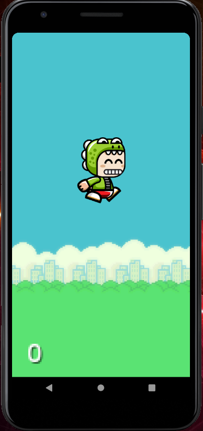
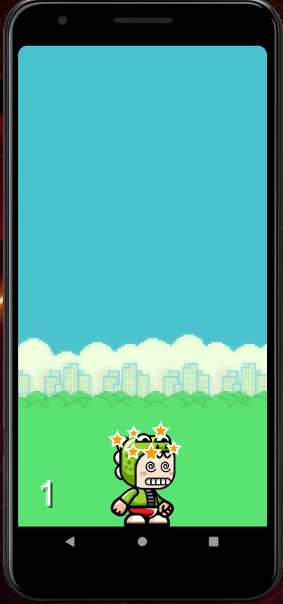

# CoinMan-Game
This is an Android Game Made using Android Studio and libGDX Framework.

## libGDX

libGDX is a cross-platform Java game development framework based on OpenGL (ES) that works on Windows, Linux, Mac OS X, Android, your WebGL enabled browser and iOS.

Download the Repository from https://github.com/Nachiket724/CoinMan-Game.git.

Here are some Screenshots about the CoinMan Game.

 

